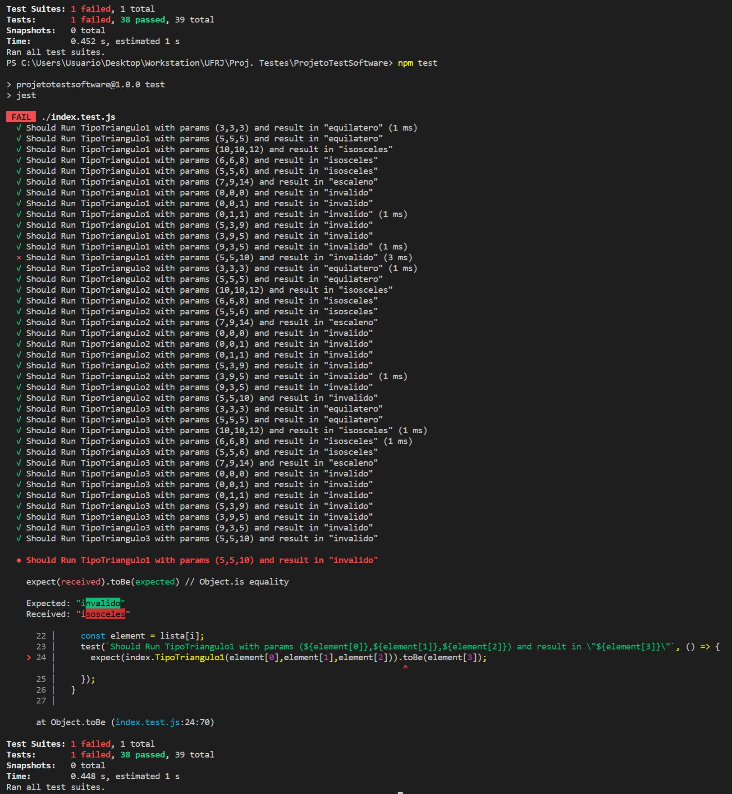

# ProjetoTestSoftware

Para rodar o programa, clone o projeto usando:

```
git clone https://github.com/chrismomentus/ProjetoTestSoftware.git
```

Entre na pasta:
```
cd ProjetoTestSoftware
```
Instale as dependencias:
```
npm install
```
Rode os testes:
```
npm test
```

Imagem do resultado esperado dos testes:
